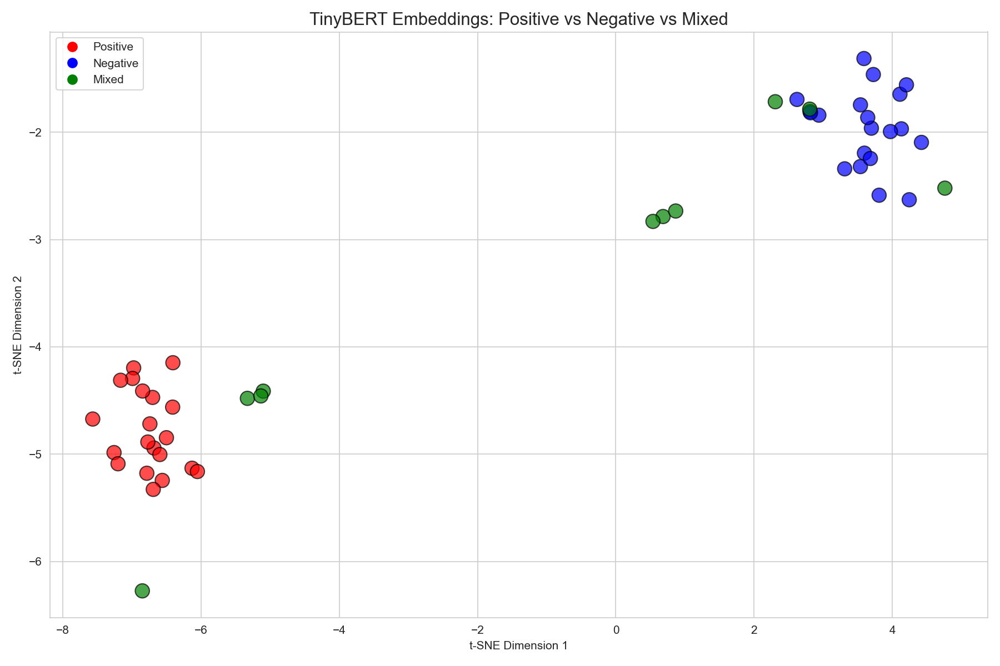

# Tiny_Bert

A lightweight implementation of the [BERT](https://arxiv.org/abs/1810.04805/) (Bidirectional Encoder Representations from Transformers) architecture, designed for educational purposes. This project breaks down the complex architecture of BERT into a "Tiny" version to make it easy to understand, modify, and experiment with.

## Features
This repository implements the core BERT architecture and applies it to four distinct Natural Language Processing (NLP) tasks:
1.  **Sentiment Analysis:** A standard sequence classification task (Positive/Negative).
2.  **Named Entity Recognition (NER):** A token-level classification task identifying entities (Person, Location, etc.).
3.  **Next Sentence Prediction (NSP):** A pre-training objective that predicts if two sentences are sequentially connected.
4.  **Multitask Learning:** A unified model that shares the BERT encoder across multiple tasks (Sentiment + Paraphrase).

## Project Structure

```
Tiny_Bert/
├── tiny_bert/                  # Core package
│   ├── __init__.py             # Re-exports TinyBERT, TinyBERTClassifier, SimpleTokenizer
│   ├── model.py                # TinyBERT and TinyBERTClassifier
│   └── tokenizer.py            # SimpleTokenizer
│
├── tasks/                      # NLP task scripts
│   ├── sentiment.py            # Movie review sentiment classifier
│   ├── ner.py                  # Named Entity Recognition
│   ├── nsp.py                  # Next Sentence Prediction
│   └── multitask.py            # Multitask model (Sentiment + Paraphrase)
│
├── visualization/              # Visualization scripts
│   ├── embeddings.py           # t-SNE of [CLS] token embeddings
│   └── attention.py            # Attention heatmaps and semantic space
│
├── examples/
│   └── pretrained_bert.py      # Standalone HuggingFace BERT demo
│
├── tests/
│   └── test_model.py           # Model configuration and shape tests
│
├── data/
│   └── reviews.csv             # Movie review dataset
│
└── outputs/                    # Generated artifacts (gitignored)
    ├── trained_bert.pt
    ├── embedding_visualization.png
    └── attention_maps/
```

##  Installation

```
pip install -r requirements.txt
```

##  Usage

All scripts are run as modules from the project root directory.

### 1. Sentiment Analysis
Train a model to classify movie reviews as Positive or Negative.
```
python -m tasks.sentiment
```

### 2. Named Entity Recognition (NER)
Train a model to identify names and locations in text (e.g., "John" -> `B-PER`, "Paris" -> `B-LOC`).
```
python -m tasks.ner
```

### 3. Next Sentence Prediction (NSP)
Train the model to understand the relationship between two sentences (Is Sentence B the true successor of Sentence A?).
```
python -m tasks.nsp
```

### 4. Multitask Learning
Run the unified model that handles multiple tasks simultaneously.
```
python -m tasks.multitask
```

### 5. Tests
Run model tests to verify different configurations, batch sizes, and sequence lengths.
```
python -m tests.test_model
```

## Visualization

After fine-tuning the TinyBERT encoder on the sentiment classification task, you can visualize the learned representations.

### Embedding Visualization
Extract [CLS] token embeddings and project them to 2D using t-SNE. 
The plot shows how the model learns to separate positive, negative, and mixed reviews in embedding space.

- **Red** — Positive reviews cluster tightly together
- **Blue** — Negative reviews form a separate cluster
- **Green** — Mixed/ambiguous reviews scatter between the two clusters, reflecting genuine sentiment uncertainty



```
python -m tasks.sentiment           # Train and save the encoder
python -m visualization.embeddings  # Visualize embeddings
```

### Attention Maps
Visualize attention heatmaps, semantic space, and cosine similarity:
```
python -m visualization.attention
```


##  References

This implementation is based on the concepts introduced in the original BERT paper:
* **BERT: Pre-training of Deep Bidirectional Transformers for Language Understanding** (Devlin et al., 2018).
* Paper PDF: [arXiv:1810.04805](https://arxiv.org/abs/1810.04805)
